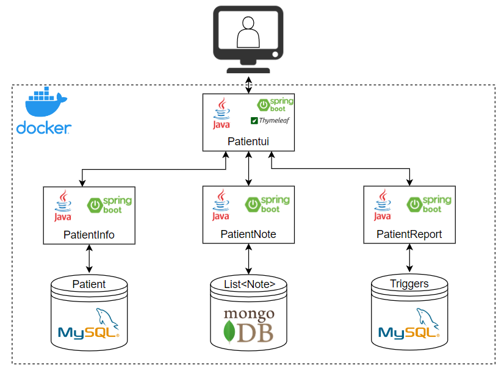

# Mediscreen

This API is used to manage a patient's personal information and doctor's medical notes. It also helps the doctor to identify the risk that a patient has diabetes.

### Architecture diagram

### Documentation for REST API services
- [Swagger documentation for PatientInfo API](http://localhost:8081/swagger-ui/index.html#/)
- [Swagger documentation for PatientNote API](http://localhost:8082/swagger-ui/index.html#/)
- [Swagger documentation for PatientReport API](http://localhost:8083/swagger-ui/index.html#/)

### Prerequisites

What things you need to install the software and how to install them

- Spring boot 3.0.4
- Java 17
- Maven 4.0.0
- Lombok 1.18.26
- MySQL 8.0.32
- MogoDB 4.8.2

### Installing

A step by step series of examples that tell you how to get a development env running:

1.Install Java:

https://www.oracle.com/java/technologies/javase/jdk17-archive-downloads.html

2.Install Maven:

https://maven.apache.org/install.html

3.Install Lombock:

https://projectlombok.org/download

4.Install MySql:

https://dev.mysql.com/downloads/mysql/

5.Install MongoDb

https://www.mongodb.com/try?jmp=nav#community

## Endpoints examples

**To get a patient's age and risk of having diabetes :** 
http://localhost:8083/PatientReport

## Swagger documentation

[http://localhost:8083/swagger-ui/index.html#/](http://localhost:8083/swagger-ui/index.html#/)

